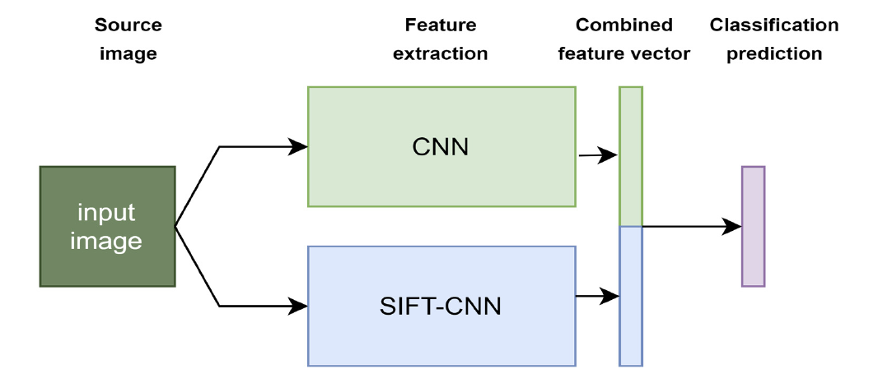
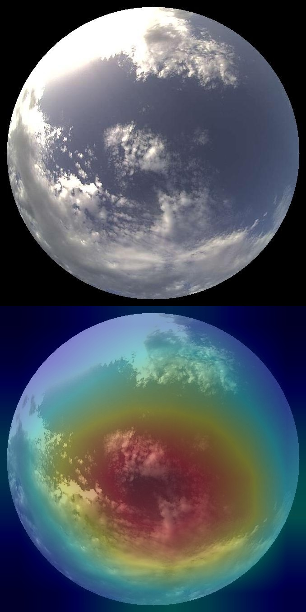

## Unofficial implementation of SIFT-CNN: When Convolutional Neural Networks Meet Dense SIFT Descriptors for Image and Sequence Classification

This repo implements the following paper:
<em>
Tsourounis, D.; Kastaniotis, D.; Theoharatos, C.; Kazantzidis, A.; Economou, G. [SIFT-CNN: When Convolutional Neural Networks Meet Dense SIFT Descriptors for Image and Sequence Classification](https://www.mdpi.com/2313-433X/8/10/256). J. Imaging 2022, 8, 256. https://doi.org/10.3390/jimaging8100256
</em>

If you use the following code you need to cite the following work:

```
@Article{jimaging8100256,
AUTHOR = {Tsourounis, Dimitrios and Kastaniotis, Dimitris and Theoharatos, Christos and Kazantzidis, Andreas and Economou, George},
TITLE = {SIFT-CNN: When Convolutional Neural Networks Meet Dense SIFT Descriptors for Image and Sequence Classification},
JOURNAL = {Journal of Imaging},
VOLUME = {8},
YEAR = {2022},
NUMBER = {10},
ARTICLE-NUMBER = {256},
URL = {https://www.mdpi.com/2313-433X/8/10/256},
ISSN = {2313-433X},
DOI = {10.3390/jimaging8100256}
}
```
 

### Notice:
We rollout pieces of the code step-by-step so stay tuned! 


### Environment setup

- Git-LFS
```
sudo apt-get install git-lfs
```

- Python


pip install -r requirements.txt


### setup environment

Tested with:
- 1.13.1+cu117

```
python3 -m venv ./myenv
source ./myenv/bin/activate
pip3 install -r requirements.txt


``` 

### Train RGB

Current script loads parms from rgb_params (central crop based to align with narrow all sky image lenses)

```bash
# train on grscd 
python deepsky/model_training/train.py --config config/gsrcd.json
```

- In another terminal run tensorboard

```bash
tensorboard --logdir runs/
```

### Train RGB+SIFT_CNN


```
python deepsky/model_training/train_siftcnn_fusion.py --config=config/grscd_imagenet_siftcnnfusion.json 
```

- In another terminal run tensorboard

```bash
tensorboard --logdir runs/
```
```
[Accuracy][2]Train, val, test =89.86565399169922 ,89.74781036376953, 82.87500762939453
100%|███████████████████████████████████████████████████████████████| 107/107 [00:32<00:00,  3.25it/s]
100%|█████████████████████████████████████████████████████████████████| 19/19 [00:05<00:00,  3.21it/s]
100%|███████████████████████████████████████████████████████████████| 125/125 [00:23<00:00,  5.23it/s]
[Accuracy][3]Train, val, test =92.14369201660156 ,90.0767593383789, 85.1500015258789
100%|███████████████████████████████████████████████████████████████| 107/107 [00:31<00:00,  3.37it/s]
100%|█████████████████████████████████████████████████████████████████| 19/19 [00:06<00:00,  3.13it/s]
100%|███████████████████████████████████████████████████████████████| 125/125 [00:23<00:00,  5.25it/s]
[Accuracy][4]Train, val, test =94.04205322265625 ,94.57237243652344, 87.12500762939453
100%|███████████████████████████████████████████████████████████████| 107/107 [00:32<00:00,  3.28it/s]
100%|█████████████████████████████████████████████████████████████████| 19/19 [00:06<00:00,  2.95it/s]
100%|███████████████████████████████████████████████████████████████| 125/125 [00:23<00:00,  5.38it/s]
[Accuracy][5]Train, val, test =94.91822052001953 ,93.25657653808594, 88.42500305175781
```

### Evaluate model

Load a checkpoint, define a train and a test set and run model evaluation

Warning: By default, the results and the confusion matrix will be writen to the model's folder in `results.txt` and `Confusion-01_25_2023_23_13_16.png`

Note 2: If you want to run an evaluation for a trained model you can find where it was trained on by looking at `runs/experiment-number.log/training.log` file. There we mention the train_data and test_data variables
However, you can run the evaluation on any dataset.


### Explainable AI

Note: Currently works only with RGB model.
Soon I will add the RGB+SIFT-CNN


 
How to use:

```
python deepsky/explainable_ai/CAM.py --image=imgs/cirrus.jpg  --model_file=runs/Jan29_16-13-18_ellab4gpu-X299X-AORUS-MASTERrgb.log/checkpoint_train_eval_other0035_99.83552551269531.pth.tar
```
```
0.992 -> 3_cirrus
0.008 -> 4_clearsky
0.000 -> 2_altocumulus
0.000 -> 7_mixed
0.000 -> 6_cumulonimbus
output CAM.jpg for the top1 prediction: 3_cirrus
```
 

## Funding

This research has been co-financed by the European Union and Greek national funds through the Operational Program Competitiveness, Entrepreneurship and Innovation, under the call RESEARCH–CREATE–INNOVATE (project code: T1EDK–00681, MIS 5067617).